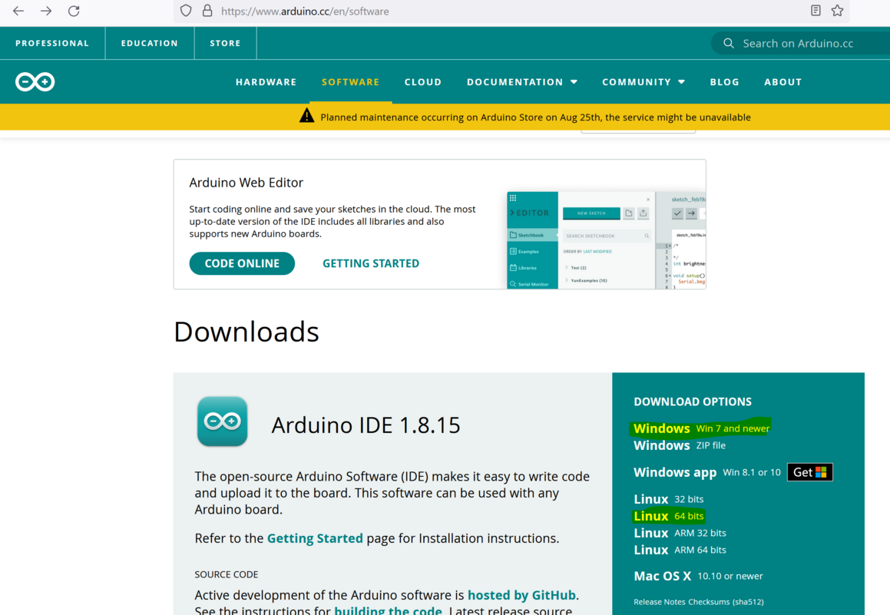
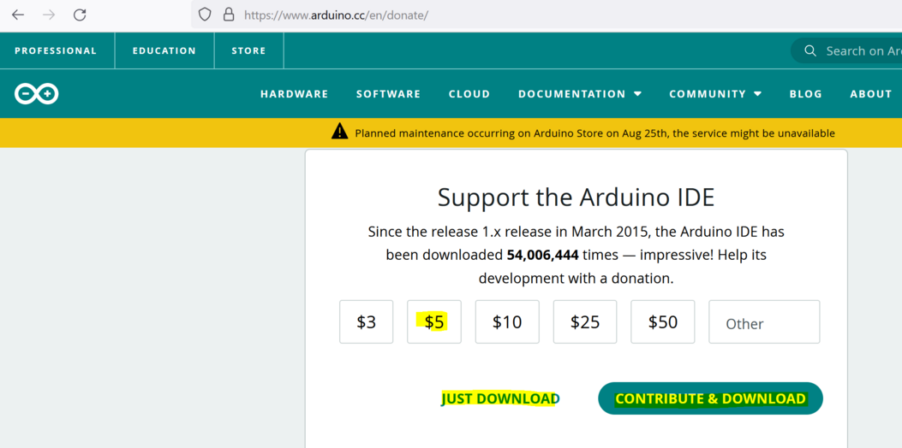
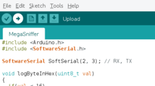

####Micro cursus Arduino IDE
De Arduino IDE is een software pakket. (ook wel Integrated Development Enviroment genaamd.
Deze software gebruik je om Arduino code (C++) te schrijven en te uploaden naar de Arduino NANO.

#####Download Arduino IDE
Ga naar https://www.arduino.cc/en/software en download de Arduino IDE.

Na het betalen van de vrijwillige $5 of, als je dat de vorige keer al gedaan hebt, even op de download link klikken.

#####Install Arduino IDE
Installeer deze door er op te dubbelklikken.

Bijna aan het einde vraagt hij nog of je extra drivers wil installeren.
Natuurlijk bevestig je dit.

Daarna is de installatie klaar.

#####Arduino Source code (Sketch) laden
Download de source code waarvan jij denkt dat het de beste is. Dit kan voor iedereen anders zijn.
Bereidt je er op voor dat je meerdere versies moet proberen, voordat je voor jouw gevoel de beste hebt. Alle versies zijn nog in ontwikkeling.

Start arduino
Ga naar de boards manager en selecteer de arduino nano.
Dit is het board wat in je step past.

#####Arduino Board Setup

en sluit dan de arduino aan.
Pas dan kun je de serial port selecteren.

Laadt nu de source code van de ge-unzipte github. of

Arduino wil er wat extra's mee doen. Bevestig dit.

Druk op compile/Upload. Dit is het tweede icon van links.

Daarna krijg je waarschijnlijk je eerste foutmelding. 

#####Arduino foutmeldingen
An error occurred while uploading the sketch

In mijn geval moest ik de oude bootloader pakken.
Dit zal voor de meeste personen zijn, die niet de 20 euro voor een originele arduino nano uitgegeven hebben.

Een andere foutmelding kan zijn dat je de foute serial port hebt.

Probeer eens een andere.

Uiteindelijk gaat het lukken.

#####Arduino finish
Success. Je eerste arduino is klaar. Nu even naar het volgende hoofstuk voor de inbouw.

##### Sketch
In de Arduino IDE heet een stuk code een 'sketch', een sketch heeft .ino als bestands extensie.
Een sketch is code gemaakt voor de Arduino, gebaseerd op de programmeer taal C++ met wat specifieke werk wijze.
#####Bibliotheken
De kracht van veel software pakketten is dat je gebruik kan maken van reeds door andere gemaakte bibliotheken. Deze bibliotheken kan je beheren via de bibliotheek manager via het menu 'Hulpmiddelen -> Bibliotheken beheren'. Dit is ook de makkelijkste methode om ontbrekende bibliotheken op te zoeken en te installeren.

Met deze kennis kunnen we naar de broncode die we nodig hebben om van een _e-step_ een _step met ondersteuning_ te maken.
#####Driver
! Afhankelijk van je besturingsysteem moet je een driver installeren om met de NANO te communiceren. Een van de meest voorkomende chips is de CH430. Deze driver kan je [hier vinden](http://www.wch-ic.com/downloads/CH341SER_ZIP.html). Een foutmelding waaraan je een ontbrekende driver kan herkennen is: 

