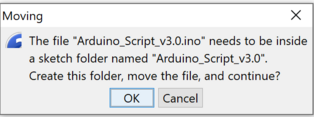
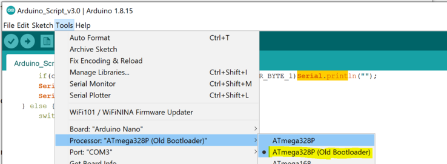

Voor het installeren van de juiste firmware op de arduino heb je de arduino IDE nodig.

Hiermee compileer je de source code van Github en maak je er firmware voor de arduino nano van.

Ga naar https://www.arduino.cc/en/software en download de Arduino IDE.

Na het betalen van de vrijwillige $5 of, als je dat de vorige keer al gedaan hebt, even op de download link klikken.

Installeer deze door er op te dubbelklikken.

Bijna aan het einde vraagt hij nog of je extra drivers wil installeren.
Natuurlijk bevestig je dit.

Daarna is de installatie klaar.

Download de source code waarvan jij denkt dat het de beste is. Dit kan voor iedereen anders zijn.
Bereidt je er op voor dat je meerdere versies moet proberen, voordat je voor jouw gevoel de beste hebt. Alle versies zijn nog in ontwikkeling.

Start arduino
Ga naar de boards manager en selecteer de arduino nano.
Dit is het board wat in je step past.

en sluit dan de arduino aan.
Pas dan kun je de serial port selecteren.

Laadt nu de source code van de ge-unzipte github.

Arduino wil er wat extra's mee doen. Bevestig dit.

Druk op compile

Daarna krijg je waarschijnlijk je eerste foutmelding. 

An error occurred while uploading the sketch

In mijn geval moest ik de oude bootloader pakken.
Dit zal voor de meeste personen zijn, die niet de 20 euro voor een originele arduino nano uitgegeven hebben.

Een andere foutmelding kan zijn dat je de foute serial port hebt.

Probeer eens een andere.

Uiteindelijk gaat het lukken.

Success. Je eerste arduino is klaar. Nu even naar het volgende hoofstuk voor de inbouw.

